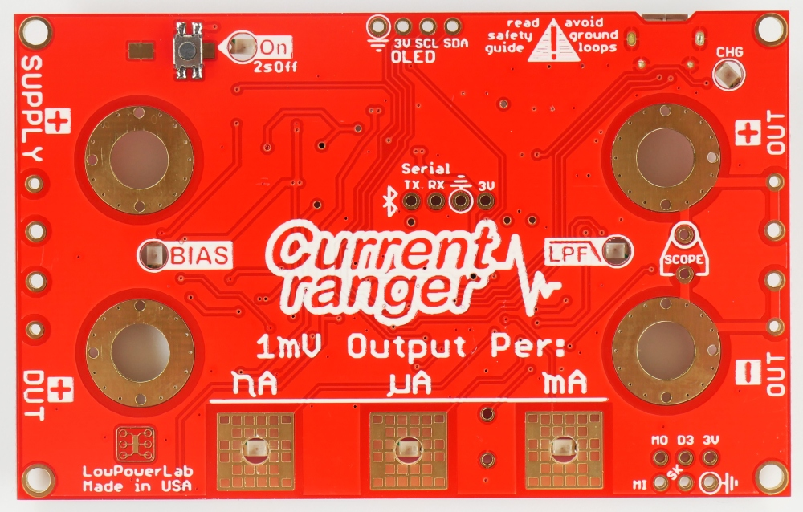

# What?

This is a modified firmware for <a href="https://github.com/LowPowerLab/CurrentRanger"> LowPowerLab's</a> **CurrentRanger_R3** with an attached OLED display:

<table>
  <tr>
    <td>
      
    </td>
    <td>
      
    </td>
    <td>
      
    </td>
  </tr>
</table>
 

This makes the unit with a LiPo battery a pretty standalone device with focus on measuring average and peak current values for easy estimation of current consumption of devices with very low current sleep periods mixed with short higher current working tasks. Display and touch pad usage is therefore changed.

This project is also modified to be compiled with either standard Arduino-IDE or vscode with the vscode-arduino plugin at the same time.

---
# Operation

Focus lies on standalone usage, so some parameters that were stored in NVM or were accessible mainly via the UART have changed.

There are two features, `BIAS` which lifts GND-ISO to 1.5V thus allowing to measure also negative current, and `LPF` which adds a low pass filter to the output and therefore ADC input line. In this firmware after powering on, the `LPF` is always enabled and `BIAS` is disabled.

To toggle `BIAS` feature touch `nA + µA` pads simultaneously, these are the both leftmost pads now assigned to the 'left' located feature. Likewise `µA + mA` toggles now the `LPF` feature. Both features can now be toggled at any time independently.

After powering on, the auto-shutdown-timer is always enabled for 600s (ten minutes) and timer countdown is shown on display top line, left to the battery symbol. Any touch action resets the timer. Touch and hold `mA` pad for >2s disables (or re-enables) the shutdown timer. There is an audible warning 5s prior to shutdown.

The unit operates in two modes, in either `MANU` or `AUTO` which is shown at the top left corner on the display. The mode is toggled by touching `nA + mA`. Whenever the actal current range is overloaded, `OVERLOAD!` is shown on display and an audible warning is enabled.

In `MANU` mode you can select the current range by the according touch pad and the according LED is lit.

In `AUTO` mode the three pads `nA`, `µA` and `mA` become new function selectors. The LEDs always indicate the range that is automatically selected for measurement.

Touching `mA` selects the standard auto-range mode which behaves like a normal auto range ammeter.

Touching `µA` selects the peak hold mode and `PEAK` is shown at the top line on the display. To reset the peak value touch and hold `µA` pad for >2s.

Touching `nA` selects the averaging mode and `AVRG` is shown at the top line on the display. Below is shown the so far running averaging time in seconds. To reset averaging timer and value touch and hold `nA` pad for >2s.

Note that switching `MANU`<>`AUTO` resets peak hold and averaging values as well.

---
# Calibration

Once a firmware is flashed, unfortunately the actual calibration data is lost. However, it makes sense to re-calibrate for this firmware anyways. Once calibrated you can type letter `c` at the serial console (via USB) to receive an easily replayable calibration data string (e.g. `:918:734:0.994:3.296:0:0`). Save that string and replay it followed by **newline** after updating the firmware. This restores the calibration data.

### Step 1

After five minutes warm-up time measure the LDO voltage (3.3V nominal) accessible on the lower right pin pads. Access UART via USB and adjust the LDO value by typing `<` and `>`.

### Step 2

Short input, select `mA` range, **disable** `BIAS` and adjust offset by typing `{` and `}` until displayed value goes positve. Adjust now for toggling -0.0 and 0.0 to best offset. Check ranges `µA` and `nA` for same result. This offset is same for all three un-BIASed ranges.

### Step 3

With still shorted input, select `mA` range, **enable** `BIAS` and adjust offset by typing `{` and `}` until displayed value is toggling between -0.0 and 0.0 as best offset. Check ranges `µA` and `nA` for same result. This offset is same for all three BIASed ranges.

### Step 4

Drive 1mA current through the unit, select `µA` range and disable `BIAS`. Now adjust display value with `[` and `]` to 1000µA.

---

# Caveats

* Unfortunately it is not clear whether the UF2 bootloader is a stock or modified one. This would be a good opportunity to provide some NVM-area for calibration data that will survive a firmware update.

* The spacing of the female banana jacks is 20mm instead of the laboratory standard 19mm. So using a shorting bridge like:  is not possible without modification. With a small round file it was no problem to oblong the mounting holes to fit the 19mm spacing. No worries about the hole plating, it works.

* Logging over USB is pretty worthless without using an isolator, but using LiPo battery and Bluetooth might be a viable option then. 

The firmware is far from being perfect. This is my first encounter to SAMD21 and gave me the insight to stay far away from it for own projects. The circuitry could surely be improved and range switching may distort the result a bit. 

However, in the current state it works as expected for me, is maybe useful for you and is also hopefully 'Good enough for Australia'. :smile:

